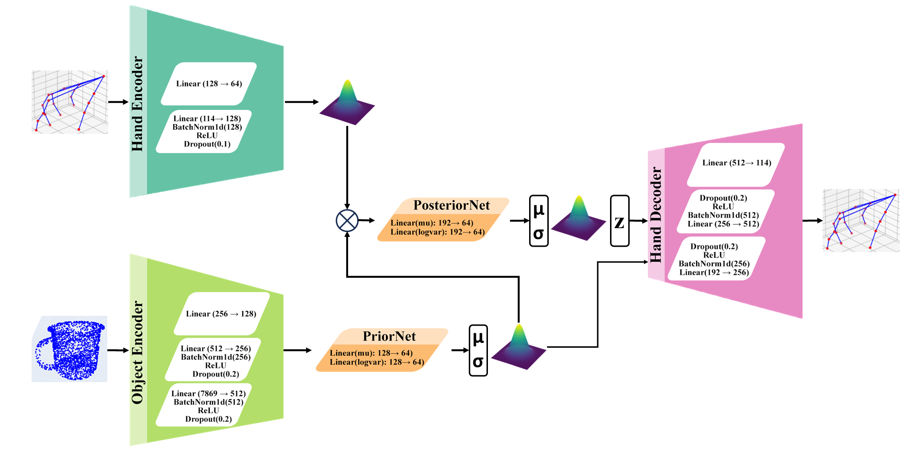
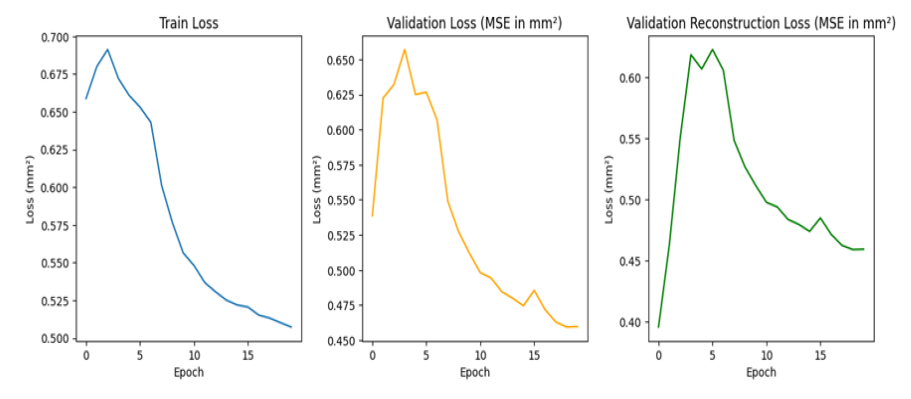
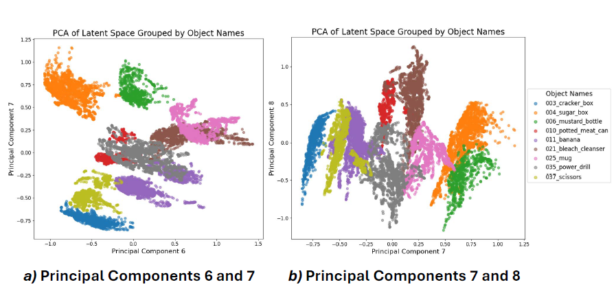
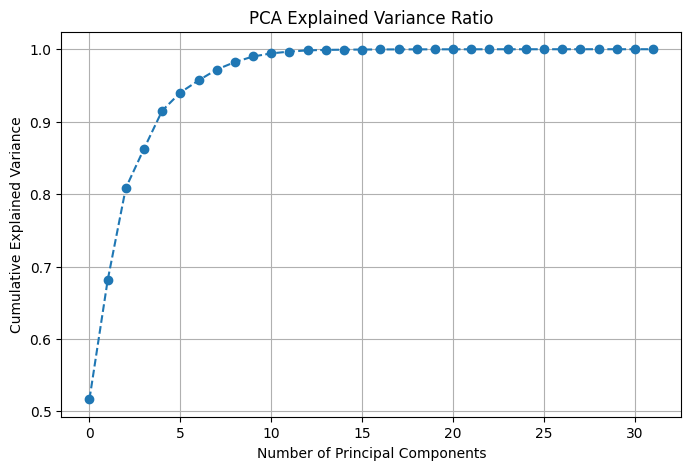
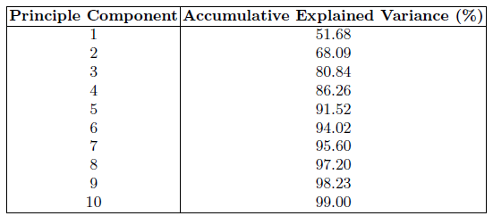
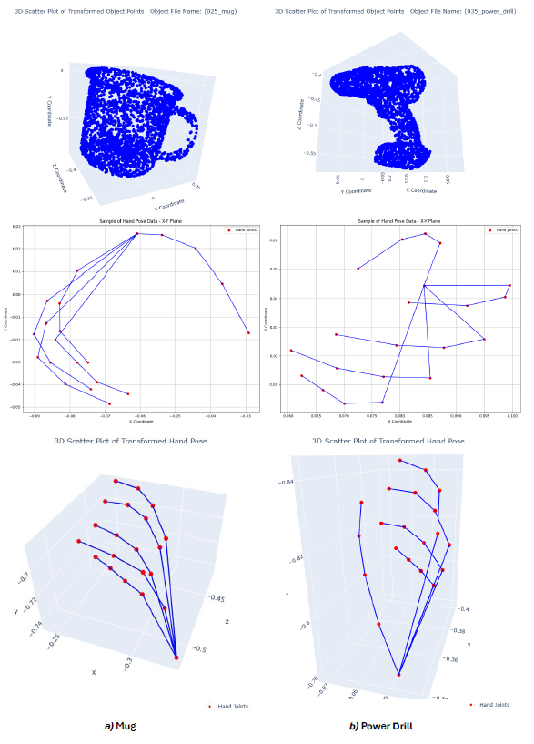

# Grasp-Object Affordances Latent: CVAE Pipeline (HO3D)

[](https://www.python.org/)
[](https://pytorch.org/)
[](LICENSE)

This repository provides a complete pipeline for extracting, preprocessing, and modeling hand-object interaction data from the HO3D dataset using a Conditional Variational Autoencoder (CVAE). The model learns to predict hand representations conditioned on object properties, revealing brain-like latent representations of object affordances.

## 📄 Paper

**Disentangling Grasp-Object Representations in the Latent Space: Toward Brain-Like Affordances for Machines**

*Authors:* Siavash Mortaz Hejri, Hamed Pourfannan, Ruidong Ma, Alejandro Jimenez Rodriguez, Alessandro Di Nuovo

📄 [Paper PDF](docs/paper.pdf) | 📊 [Poster](docs/LM2025.pdf) | 🎯 [Conference Posters](https://livingmachinesconference.eu/2025/posters/)  
🔗 [Springer Link](https://link.springer.com/chapter/10.1007/978-3-032-07448-5_35) | [DOI](https://doi.org/10.1007/978-3-032-07448-5_35)

**Conference:** Biomimetic and Biohybrid Systems (Living Machines 2025)  
**Session:** Poster Session II - Thursday 17th July, 13:00-14:30  
**Poster ID:** [054]  
**Published:** 25 November 2025

### Abstract

Humans perceive the world through their bodies. The theory of object affordances suggests that when encountering an object, our brain encodes it not only based on its physical properties but also according to how we intend to use it. Decades of foundational research in neuroscience indicate that object properties are associated with distinct regions of the sensorimotor cortex, depending on the grasp type they tend to activate. 

In this study, we trained a Conditional Variational Autoencoder (CVAE) on the HO-3D_v3 dataset to reconstruct hand poses conditioned on object properties. Principal Component Analysis (PCA), clustering, and visualization of the model's latent space revealed structured patterns for the abstract representation of the hand, which were distinctly organized according to object associations. This bears a notable resemblance to neural strategies observed in the human sensorimotor cortex for representing object-grasp relationships. 

This finding supports the notion that artificial intelligence systems can develop brain-like latent representations of object affordances. Such representations could significantly enhance robotic control in the future by enabling real-time motor planning for high-degree-of-freedom humanoid hand actions in an abstract latent space, bypassing the need for low-level pixel- and joint-level computations.

## ✨ Features

- **Complete Data Pipeline**: Extract and preprocess HO3D dataset annotations
- **CVAE Model**: PyTorch implementation with KL annealing and early stopping
- **Latent Space Analysis**: PCA, t-SNE, and clustering analysis tools
- **Visualization**: 3D point cloud visualization and training metrics plotting
- **Reproducible**: All analysis scripts to reproduce paper results

## 📋 Table of Contents

- [Installation](#installation)
- [Dataset](#-dataset)
- [Quick Start](#quick-start)
- [Data Pipeline](#data-pipeline)
- [Model Training](#model-training)
- [Analysis & Visualization](#analysis--visualization)
- [Repository Structure](#repository-structure)
- [Citation](#citation)
- [License](#license)

## 🚀 Installation

### Prerequisites

- Python 3.10 or higher
- CUDA-capable GPU (recommended for training)
- HO3D_v3 dataset (see [Dataset](#-dataset) section below)

### Setup

1. **Clone the repository:**
   ```bash
   git clone https://github.com/Siavash-Mortaz/grasp-object-affordances-latent.git
   cd grasp-object-affordances-latent
   ```

2. **Create a virtual environment:**
   ```bash
   python -m venv venv
   source venv/bin/activate  # On Windows: venv\Scripts\activate
   ```

3. **Install dependencies:**
   ```bash
   pip install -r requirements.txt
   ```

4. **Download and configure the HO3D_v3 dataset:**
   
   - Download the dataset from: [HO-3D v3 Download Link](https://1drv.ms/f/s!AsG9HA3ULXQRlFy5tCZXahAe3bEV?e=BevrKO)
   - Extract the dataset to your desired location
   - Edit `src/utils/paths.py` and update the HO3D dataset paths:
     ```python
     HO3D_ROOT = Path(r"YOUR_PATH_TO_HO3D_v3")
     HO3D_MODELS = HO3D_ROOT / "models"
     ```

## 📦 Dataset

This project uses the **HO3D_v3** (Hand-Object 3D) dataset. 

### Download

Download the HO3D_v3 dataset from the official source:

🔗 **[HO-3D v3 Download Link](https://1drv.ms/f/s!AsG9HA3ULXQRlFy5tCZXahAe3bEV?e=BevrKO)**

### Dataset Structure

After downloading and extracting, your dataset should have the following structure:

```
HO3D_v3/
├── train.txt                    # Training sequence list
├── test.txt                     # Test sequence list
├── train/                       # Training sequences
│   └── [sequence_name]/
│       ├── meta/
│       │   └── [frame_id].pkl  # Annotations
│       └── ...
└── models/                      # Object models
    └── [object_name]/
        └── points.xyz          # Object point clouds
```

### Citation

If you use the HO3D dataset, please cite the original paper:
- Hampali, S., Rad, M., Oberweger, M., & Lepetit, V. (2020). HOnnotate: A method for 3D annotation of hand and object poses. In *Proceedings of the IEEE/CVF Conference on Computer Vision and Pattern Recognition*.

## 🏃 Quick Start

```bash
# 1. Extract data from HO3D dataset
python -m src.data.extract_data --split train

# 2. Preprocess and split data
python -m src.data.preprocess

# 3. Train the CVAE model
python -m src.models.cvae --epochs 100 --batch-size 64

# 4. Analyze latent space
python -m src.analysis.latent_analysis --split test
python -m src.analysis.pca_analysis
```

## 📊 Data Pipeline

### 1. Extract Data

Extract hand and object information from HO3D annotations:

```bash
python -m src.data.extract_data \
  --split train \
  --ho3d-root "path/to/HO3D_v3" \
  --models-dir "path/to/HO3D_v3/models" \
  --out-dir data/interim
```

**Output:** `data/interim/hand_poses.pkl`, `object_infos.pkl`, `file_infos.pkl`

### 2. Inspect Extracted Data (Optional)

```bash
python -m src.data.inspect_extracted --in-dir data/interim
```

### 3. Preprocess and Split

Normalize features and split into train/validation/test sets:

```bash
python -m src.data.preprocess \
  --in-dir data/interim \
  --out-dir data/processed \
  --test-size 0.2 \
  --val-size 0.25 \
  --seed 42
```

**Features normalized:**
- Hand pose (48 dims)
- Hand joints (21×3 = 63 dims)
- Hand translation (3 dims)
- Object translation (3 dims)
- Object rotation (3 dims)
- Object point cloud (2621×3 = 7863 dims)

**Output:** `data/processed/hand_object_data.pkl`, `scalers.pkl`

### 4. Inspect Processed Data (Optional)

```bash
python -m src.data.inspect_processed --data-file data/processed/hand_object_data.pkl
```

## 🧠 Model Training

Train the Conditional VAE model:

```bash
python -m src.models.cvae \
  --data-file data/processed/hand_object_data.pkl \
  --epochs 100 \
  --batch-size 64 \
  --lr 1e-3 \
  --weight-decay 1e-5 \
  --latent-dim 64 \
  --device cuda
```

**Model Architecture:**
- Object Encoder: 7869 → 512 → 256 → 128
- Hand Encoder: 114 → 128 → 64
- Latent Dimension: 64 (configurable)
- Decoder: 64+128 → 256 → 512 → 114

**Training Features:**
- KL divergence annealing (20-epoch warmup)
- Early stopping (patience=10)
- Learning rate scheduling
- Detailed error tracking (pose, joints, translation)

**Outputs:**
- Model checkpoint: `outputs/checkpoints/best_cvae_hand_pose.pth`
- Training metrics: `outputs/metrics/cvae_losses_errors.pkl`

## 📈 Analysis & Visualization

### Training Metrics

Visualize training and validation losses:

```bash
python -m src.analysis.plot_training_metrics \
  --metrics-file outputs/metrics/cvae_losses_errors.pkl \
  --save-dir outputs/figures
```

### Latent Space Analysis

1. **Compute Latent Vectors:**
   ```bash
   python -m src.analysis.latent_analysis \
     --model-path outputs/checkpoints/best_cvae_hand_pose.pth \
     --split test
   ```

2. **PCA Analysis:**
   ```bash
   python -m src.analysis.pca_analysis \
     --latent-file outputs/latent_test.pkl \
     --pc-x 7 --pc-y 8 --pc-z 9 \
     --with-centroids
   ```

3. **t-SNE Analysis:**
   ```bash
   # 2D t-SNE
   python -m src.analysis.tsne_analysis --n-components 2
   
   # 3D t-SNE
   python -m src.analysis.tsne_analysis --n-components 3
   ```

4. **Clustering Analysis:**
   ```bash
   # Full analysis with elbow method and silhouette scores
   python -m src.analysis.clustering_analysis \
     --do-elbow --do-silhouette \
     --n-clusters 7 --with-labels
   ```

### 3D Object Visualization

Visualize transformed object point clouds:

```bash
python -m src.viz.object_3d \
  --index 0 \
  --in-dir data/interim \
  --use-plotly
```

## 📁 Repository Structure

```
.
├── README.md
├── requirements.txt
├── .gitignore
│
├── assets/                      # Figures and diagrams
│   ├── cvae_architecture.png
│   ├── loss_curves.png
│   ├── pca_scatter.png
│   └── ...
│
├── data/                        # Data files (gitignored)
│   ├── interim/                # Extracted data
│   └── processed/              # Preprocessed data
│
├── docs/                        # Documentation
│   ├── paper.pdf
│   └── LM2025.pptx              # Poster presented at Living Machines 2025
│
├── outputs/                     # Training outputs (gitignored)
│   ├── checkpoints/
│   ├── metrics/
│   └── figures/
│
└── src/
    ├── analysis/               # Analysis scripts
    │   ├── clustering_analysis.py
    │   ├── latent_analysis.py
    │   ├── pca_analysis.py
    │   ├── plot_training_metrics.py
    │   └── tsne_analysis.py
    │
    ├── data/                   # Data processing
    │   ├── extract_data.py
    │   ├── inspect_extracted.py
    │   ├── inspect_processed.py
    │   └── preprocess.py
    │
    ├── models/                 # Model definitions
    │   └── cvae.py
    │
    ├── utils/                  # Utilities
    │   └── paths.py
    │
    └── viz/                    # Visualization
        └── object_3d.py
```

## 🖼️ Results

### Model Architecture



### Training Metrics



### Latent Space Analysis







### Reconstruction Results



## 📚 Citation

If you use this code or find our work helpful, please cite our paper:

```bibtex
@inproceedings{hejri2025disentangling,
  title={Disentangling Grasp-Object Representations in the Latent Space: Toward Brain-Like Affordances for Machines},
  author={Hejri, Siavash Mortaz and Pourfannan, Hamed and Ma, Ruidong and Rodriguez, Alejandro Jimenez and Di Nuovo, Alessandro},
  booktitle={Biomimetic and Biohybrid Systems},
  series={Lecture Notes in Computer Science},
  volume={15582},
  pages={415--426},
  year={2025},
  publisher={Springer, Cham},
  doi={10.1007/978-3-032-07448-5_35},
  url={https://link.springer.com/chapter/10.1007/978-3-032-07448-5_35}
}
```

## 🤝 Contributing

Contributions are welcome! Please feel free to submit a Pull Request.

## 📝 License

This project is licensed under the MIT License - see the [LICENSE](LICENSE) file for details.

## 🙏 Acknowledgments

This work was funded by Innovate UK (grant number 10089807 for the Horizon Europe project PRIMI Grant agreement n. 101120727).

## 📧 Contact

For questions or issues, please open an issue on GitHub or contact the authors.

---

**Note:** This repository accompanies the paper "Disentangling Grasp-Object Representations in the Latent Space: Toward Brain-Like Affordances for Machines" published at Living Machines 2025.
